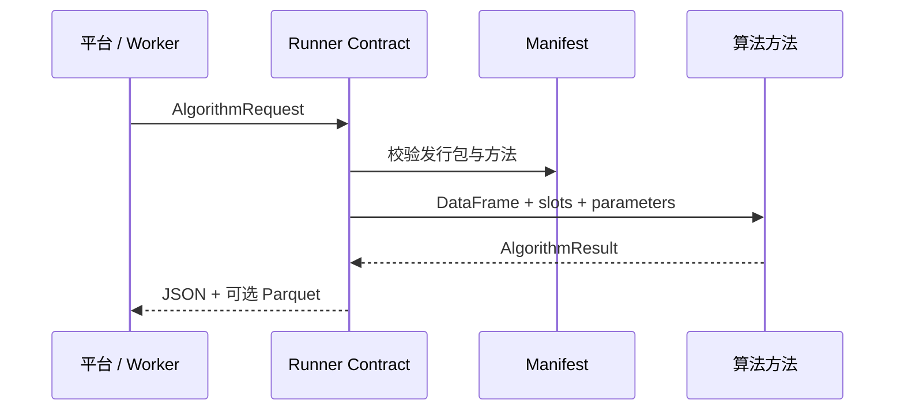

# 数析算法库 · Data Analysis Algorithm Library

> 每个算法都是一颗可校验、可复现、能被平台安全调用的星。

这是“数析”平台的独立算法运行库：接收平台准备好的表格、字段角色、参数和运行上下文，返回统一结构化结果；平台负责账号、权限、任务、报告排版和文件存储。

算法库不读取平台数据库、不访问用户目录、不启动 FastAPI，也不把前端图表配置写进算法函数。算法可以独立开发、校验、升级，再由平台按发行版本导入和使用。

## 当前能力

- 1 个完整发行包、8 个内部模块、29 个算法组。
- 31 项前台功能和 53 个稳定 `operation_key`。
- 数据处理、描述分析、时序与信号、统计关联、统计建模、聚类、基础分类和 LightGBM 分类。
- 字段槽位、定类/定量标签、参数 Schema、中文元数据和结果警告的统一协议。
- JSON 结果、可选 Parquet 数据输出、图表描述、发行包整库校验、内容哈希、本地执行器、Qt 算法工作台和完整测试。

## 分层结构

```text
完整算法库发行包（library_manifest.json）
└─ 内部算法模块（manifest.json）
   └─ 算法组（algorithm_id）
      └─ 可执行方法（method_id / operation_key）
```

完整发行包是平台导入、校验和发布的单位；内部模块可以独立演进并在不同发行版中复用；可执行方法是任务调度和历史复现的最小单位。

## 安装、校验与运行

```powershell
py -3.11 -m venv .venv
.\\.venv\\Scripts\\python -m pip install -e ".[dev,full]"

.\\.venv\\Scripts\\python -m algorithm_cli validate-library packages --json
.\\.venv\\Scripts\\python -m algorithm_cli inspect-library packages
.\\.venv\\Scripts\\python -m algorithm_cli hash-library packages

.\\.venv\\Scripts\\python examples/生成示例数据.py
.\\.venv\\Scripts\\python -m runner_contract --package-dir packages/descriptive_analysis --input examples/data/学生成绩.parquet --request examples/数据概览请求.json --output output/data_overview
```

成功后会得到 `result.json`；需要输出新表时还会得到 `data.parquet`。平台 Worker 会以相同协议为每个任务创建受控执行上下文。

## 开发与维护

新增算法时，为方法登记稳定的 `operation_key`、字段槽位、参数 Schema、中英文展示元数据和独立测试。修改算法时提升模块补丁版本，并让发行清单引用新版本；历史任务仍使用提交时固定的包和方法快照。

```powershell
.\\.venv\\Scripts\\python -m algorithm_cli validate packages/descriptive_analysis
.\\.venv\\Scripts\\python -m ruff check .
.\\.venv\\Scripts\\python -m ruff format --check .
.\\.venv\\Scripts\\python -m mypy
.\\.venv\\Scripts\\python -m pytest
```

## 算法工作台

可选的 PySide6 工作台直接读取真实清单，支持浏览算法树、编辑 Python/JSON/Markdown、新增算法和方法、整库校验、测试、构建与主题切换：

```powershell
.\\.venv\\Scripts\\python -m pip install -e ".[studio]"
.\\.venv\\Scripts\\dal-studio
```

工作台是开发维护工具，不会进入平台 Worker 的运行依赖。

## 与平台的边界



算法库返回指标、结果表、图表数据、警告和元数据；最终 HTML/PDF/Word 报告由平台渲染器生成。算法库本身不监听端口，也不直接生成前端页面。

## 文档入口

- [算法库实现说明](docs/算法库实现说明.md)
- [算法库工作台](docs/算法库工作台.md)
- [运行协议（平台）](../DataAnalysisSystem/docs/05-算法库与运行协议.md)
- [平台对接说明](../DataAnalysisSystem/docs/22-完整算法库发行与模块对齐实现说明.md)

## License

许可证与第三方依赖的最终组合正在项目治理中统一确认；发布前请按组织约定补充正式许可证文件。
