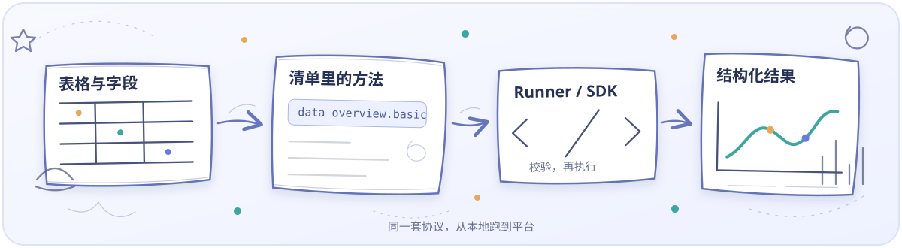
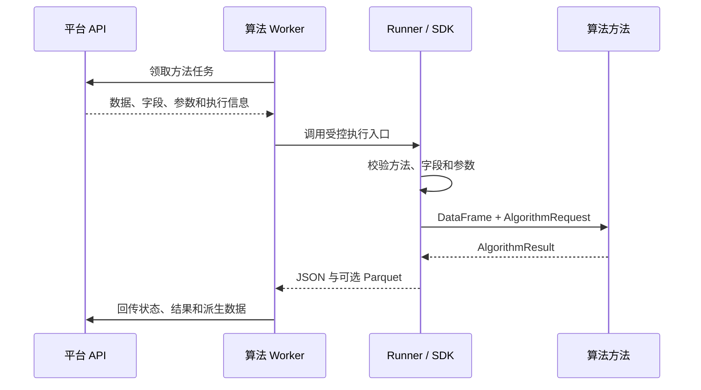

<div align="center">


# 数析算法库 · Data Analysis Algorithm Library

这里放算法，也放清单、协议和能把它们跑起来的工具。

[](pyproject.toml)
[](packages/library_manifest.json)
[](#算法目录)
[](#算法目录)
[](#算法工作台)

[项目介绍](#项目介绍) · [快速开始](#快速开始) · [算法目录](#算法目录) · [算法工作台](#算法工作台) · [开发与发布](#开发与发布) · [文档索引](docs/文档索引.md) · [数析平台](https://github.com/Drmufeng/DataAnalysisSystem)

</div>

## 项目介绍

数析把实际计算放在这个独立的 Python 仓库里。这里保存数据处理、统计分析和机器学习方法，也保存每个方法的输入要求、参数定义、结果结构和测试。

平台提交任务后，Worker 根据 `operation_key` 找到方法，将表格、字段角色、参数和运行上下文交给它。方法返回指标、结果表、图表描述，处理类方法还可以返回一份新的数据。命令行、Python SDK 和平台 Worker 使用的是同一套协议。

这个仓库不负责账号、权限、任务调度和网页报告，这些功能在[数析平台](https://github.com/Drmufeng/DataAnalysisSystem)中。算法库本身不需要启动 Web 服务。平时可以在 IDE 中维护源码，也可以使用仓库自带的 PySide6 工作台。



### 从哪里开始

| 你准备做什么 | 建议入口 |
| --- | --- |
| 第一次运行仓库 | 跟着[快速开始](#快速开始)完成安装、校验和真实示例 |
| 查找已有方法 | 浏览[算法目录](#算法目录)和各模块说明 |
| 在界面中维护代码 | 安装并打开[算法工作台](#算法工作台) |
| 新增或修改算法 | 阅读[开发与发布](#开发与发布)和[文档索引](docs/文档索引.md) |
| 接入平台 Worker | 查看[平台运行协议](https://github.com/Drmufeng/DataAnalysisSystem/blob/main/docs/协议与规范/05-算法库与运行协议.md) |

## 算法目录

当前根清单版本为 **0.2.0**，包含 **8 个模块、29 个算法组、53 个可执行方法**。下表按实际模块清单统计；平台面向用户的功能入口可以对这些方法重新组织。

| 模块 | 典型能力 | 算法组 | 方法 |
| --- | --- | ---: | ---: |
| [数据处理](packages/data_processing/README.md) | 数据编码、异常值处理、无效样本处理 | 3 | 10 |
| [描述分析](packages/descriptive_analysis/README.md) | 数据概览、频数、列联分析、描述统计、分组汇总、正态性检验 | 6 | 10 |
| [时序与信号](packages/time_signal_processing/README.md) | 时间窗口处理、数据降采样 | 2 | 4 |
| [统计关联](packages/statistical_association/README.md) | 相关分析、Cochran Q、Kappa、Kendall W、典型相关、游程检验等 | 8 | 15 |
| [统计建模](packages/statistical_models/README.md) | 线性回归、岭回归、分层回归、灰色预测、主成分分析 | 5 | 7 |
| [聚类](packages/clustering_models/README.md) | K-means、DBSCAN | 2 | 2 |
| [基础分类](packages/ml_classification/README.md) | 逻辑回归、朴素贝叶斯 | 2 | 4 |
| [LightGBM 分类](packages/lightgbm_classification/README.md) | 梯度提升分类 | 1 | 1 |
| 合计 | 以各模块 manifest.json 为准 | 29 | 53 |

“算法组”用于组织相关方法，“方法”才是可以执行的入口。例如，`data_overview.basic` 是数据概览的一个可执行方法。算法的具体参数、字段要求和统计前提见对应模块说明与清单。

## 包、模块与方法的关系

```text
完整发行包：library_manifest.json
│  平台按这个单位导入、校验与发布
│
├─ 模块：descriptive_analysis / manifest.json
│  ├─ 算法组：data_overview
│  │  └─ 方法：basic → operation_key = data_overview.basic
│  └─ 其他算法组
│
└─ 其他内部模块，各自维护版本
```

根清单引用模块编号、版本和清单路径。模块可以在多个整库发行版之间复用，平台任务选择具体方法执行。发布时必须同时检查根清单和内部模块，避免清单、依赖与入口函数不一致。

根清单协议、模块展示协议和运行上下文的协议版本是不同字段。当前模块同时存在 `1.0` 和 `1.1`，不能把它们视为整个项目只有一个统一协议号。

## 输入与输出协议

### 输入

| 内容 | 含义 |
| --- | --- |
| DataFrame | 已读取的表格副本 |
| operation_key | 本次要运行的方法 |
| slots | 字段角色与列名，如数值列、自变量、因变量 |
| parameters | 通过方法 Schema 校验的运行参数 |
| context | 运行编号、语言、随机种子和字段元数据等 |

字段元数据区分实际数据类型与定类/定量标签。例如，数值形式的学号仍可以作为定类标识符处理。执行器会结合实际数据校验字段，参数与字段不符合要求时返回结构化错误。

独立文件执行器 `runner_contract` 当前接受 Parquet 输入。CSV/XLSX 上传和读取由平台适配层处理，因此用户上传格式与底层执行器格式可以不同。

### 输出

| 字段或文件 | 用途 |
| --- | --- |
| metrics | 核心指标，例如样本量、拟合统计量 |
| tables | 统计结果表与数据预览 |
| charts | 与前端框架无关的图表数据描述 |
| presentation | 可选报告区块、顺序、宽度和结果引用 |
| warnings | 需要展示给用户的非致命问题 |
| metadata | 输入输出规模、方法、字段等运行信息 |
| data.parquet | 处理类方法产生的新数据表，存在时单独保存 |

结果经过严格 JSON 转换，处理 NumPy 标量、时间值和缺失值，并禁止把 `NaN`、`Infinity` 直接写入 JSON。报告区块只能引用本次结果中实际存在的指标、表或图。

平台根据这些数据生成网页报告及 PDF/Word 导出。图表是否出现、展示什么内容，取决于方法返回的数据；新增一种平台尚不支持的图表描述时，需要同时更新渲染器。

## 快速开始

以下命令在 Windows PowerShell 中执行。Python 支持 3.11 和 3.12；Linux/macOS 使用 `python3.11` 或 `python3.12` 创建环境，再将命令中的 `.\.venv\Scripts\python.exe` 替换为 `.venv/bin/python`。

### 1. 安装依赖

```powershell
git clone https://github.com/Drmufeng/DataAnalysisAlgorithmLibrary.git
Set-Location .\DataAnalysisAlgorithmLibrary
py -3.11 -m venv .venv
.\.venv\Scripts\python.exe -m pip install -e ".[dev,full]"
```

| 安装方式 | 用途 |
| --- | --- |
| `pip install -e .` | 基础算法、SDK 与命令行执行器 |
| `pip install -e ".[full]"` | 加装 LightGBM，运行当前完整目录 |
| `pip install -e ".[dev,full]"` | 开发、测试和发行构建 |
| `pip install -e ".[dev,full,studio]"` | 同时安装 Qt 工作台 |

上述 `pip` 均应使用目标虚拟环境中的 `python -m pip` 执行。普通 Worker 环境不需要安装 `studio`。

### 2. 校验完整发行包

```powershell
.\.venv\Scripts\python.exe -m algorithm_cli validate-library packages --json
.\.venv\Scripts\python.exe -m algorithm_cli inspect-library packages
.\.venv\Scripts\python.exe -m algorithm_cli hash-library packages
```

| 命令 | 检查或输出什么 |
| --- | --- |
| validate-library | 根清单、模块对齐、字段与参数定义、入口和依赖等 |
| inspect-library | 发行包元数据，以及模块、算法组和方法统计 |
| hash-library | 完整算法库的内容哈希 |

校验失败时先处理输出中的具体问题。`--skip-dependencies` 可用于结构检查，但跳过依赖检查的结果不能证明执行环境已经齐备。

### 3. 跑一个真实示例

仓库提供了一份可生成的学生成绩示例，包含 5 行数据和一个缺失成绩：

```powershell
.\.venv\Scripts\python.exe examples/生成示例数据.py
.\.venv\Scripts\python.exe -m runner_contract `
  --package-dir packages/descriptive_analysis `
  --input examples/data/学生成绩.parquet `
  --request examples/数据概览请求.json `
  --output output/data_overview
```

反引号是 PowerShell 的续行符，后面不要加空格。运行请求使用仓库中的[数据概览请求](examples/数据概览请求.json)，例如：

```json
{
  "operation_key": "data_overview.basic",
  "slots": {
    "columns": ["学号", "性别", "成绩", "提交时间"]
  },
  "parameters": {
    "preview_rows": 5,
    "include_missing": true,
    "include_unique": true,
    "include_duplicates": true
  }
}
```

上面仅展示完整请求中的方法、槽位和参数，实际运行使用示例文件内的 `context` 和字段元数据。

查看输出：

```powershell
Get-Content output/data_overview/result.json -Raw -Encoding utf8
```

数据概览属于分析方法，返回指标和结果表；只有产生新数据的处理方法才会额外写出 `data.parquet`。CLI 退出码 `0` 表示成功，`1` 表示预期的协议或数据错误，`2` 表示未处理的内部错误；失败详情也会写入 `result.json`。

### 4. 在 Python 中调用

下面的代码在算法库根目录运行，复用已经生成的示例数据和请求：

```python
from pathlib import Path
import json

import pandas as pd

from algorithm_sdk.models import AlgorithmRequest
from algorithm_sdk.serialization import result_to_payload
from runner_contract.runner import run_operation

root = Path.cwd()
request = AlgorithmRequest.model_validate_json(
    (root / "examples/数据概览请求.json").read_text(encoding="utf-8")
)
data = pd.read_parquet(root / "examples/data/学生成绩.parquet")
result = run_operation(root / "packages/descriptive_analysis", data, request)

print(json.dumps(result_to_payload(result), ensure_ascii=False, indent=2))
```

## 算法工作台

PySide6 工作台用于维护本地算法源码，直接读写现有清单和 Python 文件。IDE 与工作台看到的是同一份项目内容。

```powershell
.\.venv\Scripts\python.exe -m pip install -e ".[studio]"
.\.venv\Scripts\python.exe -m algorithm_studio
```

安装后也可使用 `.venv\Scripts\dal-studio` 入口。工作台的主要区域为：

| 区域 | 操作 |
| --- | --- |
| 左侧算法树 | 浏览发行包、模块、算法组和方法，搜索目录 |
| 中间文件编辑区 | 编辑 Python、JSON、Markdown，跳转到方法入口 |
| 右侧元数据区 | 查看所选算法或方法的协议定义 |
| 底部命令输出 | 查看校验、测试和构建的执行结果 |

“新增算法”和“新增方法”向导会生成或修改清单、Python 入口、测试骨架及整库运行用例，并提升相应补丁版本。创建后执行整库校验，失败时回滚本次创建。

当前工作台覆盖源码维护、方法创建和质量命令。新建完整模块向导、参数 Schema 表单、结构化结果预览等仍是后续能力，详见[算法库工作台说明](docs/算法库工作台.md)。

## 开发与发布

### 新增或修改算法

1. 选择现有模块，确认算法组、方法编号和稳定的 `operation_key`。
2. 实现 Python 入口，声明字段槽位、参数 Schema、中英文名称与说明。
3. 返回 `AlgorithmResult`，按需要填写指标、表、图、警告及报告排版引用。
4. 为正常数据、缺失值、错误字段、样本量边界和可复现性补充测试。
5. 提升被修改模块版本，更新根清单引用与整库发行版本。
6. 校验、测试并构建发行包，交给平台导入和发布。

已有方法的含义不应在原版本下静默变化。新增不兼容行为时，需要同时调整版本、文档和调用方。

### 质量检查

```powershell
.\.venv\Scripts\python.exe -m ruff check .
.\.venv\Scripts\python.exe -m ruff format --check .
.\.venv\Scripts\python.exe -m mypy
.\.venv\Scripts\python.exe -m pytest
.\.venv\Scripts\python.exe -m algorithm_cli validate-library packages --json
```

开发时可以单独校验模块：

```powershell
.\.venv\Scripts\python.exe -m algorithm_cli validate packages/descriptive_analysis
```

模块检查用于定位问题，平台发布仍以完整发行包校验为准。库中的测试覆盖协议校验、算法边界、严格 JSON 和可信数值库对照；具体用例见 [tests](tests)。

### 构建与平台接入

```powershell
.\.venv\Scripts\python.exe -m build
```

构建产物位于 `dist/`。平台通过完整发行包识别 `library_manifest.json`、引用模块与方法，校验后登记发布记录。执行节点也需要安装对应源码和依赖，单纯上传包不等于所有 Worker 已自动升级。

运行时由平台提交具体方法任务，Worker 调用执行器并收集结果：



## 常见问题

<details>
<summary>是不是要先启动算法库服务器？</summary>

不需要。独立执行器每次运行一个任务，结束后退出；平台侧常驻的是 Worker。Qt 工作台只在开发维护时打开。

</details>

<details>
<summary>为什么上传的是 Excel，执行器却使用 Parquet？</summary>

平台读取用户上传的 CSV/XLSX，并在受控执行过程中做格式适配。算法库统一接收 DataFrame 或内部 Parquet，避免每个方法重复实现文件上传与解析。

</details>

<details>
<summary>为什么整库校验提示 LightGBM 依赖缺失？</summary>

LightGBM 位于 `full` 可选依赖组。运行或校验完整目录前，使用算法库虚拟环境安装 `.[full]`。结构校验跳过依赖后仍不能运行缺失依赖的方法。

</details>

<details>
<summary>新增算法之后，平台能自动出现它吗？</summary>

需要更新清单和发行版本，完成平台导入、校验、启用以及 Worker 环境对齐。符合已有字段、参数、结果和展示协议的方法可以复用动态目录与报告渲染器；协议变更需同步平台。

</details>

<details>
<summary>算法库会直接调用 AI 或访问平台数据库吗？</summary>

不会。算法函数按输入数据计算结果，身份、存储、调度、AI 和费用管理属于平台职责。请按实现说明保持这一边界。

</details>

## 目录与文档

```text
DataAnalysisAlgorithmLibrary/
├─ algorithm_sdk/           请求、结果、错误、清单和公共校验
├─ algorithm_cli/           整库/模块校验、检查和内容哈希
├─ runner_contract/         Python 调用与文件执行入口
├─ algorithm_studio/        可选 Qt 算法维护工作台
├─ packages/
│  ├─ library_manifest.json 完整发行包根清单
│  └─ <module>/            模块清单、源码与方法说明
├─ examples/                可重复生成的样例与运行请求
├─ tests/                   SDK、算法、执行器和工作台测试
├─ docs/                    实现与报告协议文档
├─ output/                  本地运行输出
└─ pyproject.toml           Python 包与依赖配置
```

| 文档 | 内容 |
| --- | --- |
| [文档索引](docs/文档索引.md) | 当前文档职责、跨仓库边界和发布前检查 |
| [算法库实现说明](docs/算法库实现说明.md) | 协议、校验、错误与运行边界 |
| [报告排版协议](docs/报告排版协议.md) | 图表、表格与排版声明如何交给平台 |
| [算法工作台](docs/算法库工作台.md) | Qt 界面、方法创建与当前限制 |
| [项目说明](项目说明.md) | 项目概况和维护背景 |
| [平台运行协议](https://github.com/Drmufeng/DataAnalysisSystem/blob/main/docs/协议与规范/05-算法库与运行协议.md) | 平台与算法库之间的接口约定 |
| [整库发行与模块对齐](https://github.com/Drmufeng/DataAnalysisSystem/blob/main/docs/功能实现/22-完整算法库发行与模块对齐实现说明.md) | 完整发行包的导入和发布流程 |

## 许可与仓库内容

本项目源代码按 [Apache License 2.0](LICENSE) 发布。你可以使用、修改和分发代码，但需要保留许可证和版权声明，并遵守 Apache 2.0 的专利与免责声明条款。

PySide6、PyQtDarkTheme-fork 以及其他依赖使用各自的许可证；它们的许可证不会因为本项目采用 Apache 2.0 而改变。算法工作台的依赖说明见[工作台文档](docs/算法库工作台.md)。

仓库发布项目源码、清单、测试和示例。个人论文模板、真实业务数据、虚拟环境、构建产物和运行输出不随源码提交。
